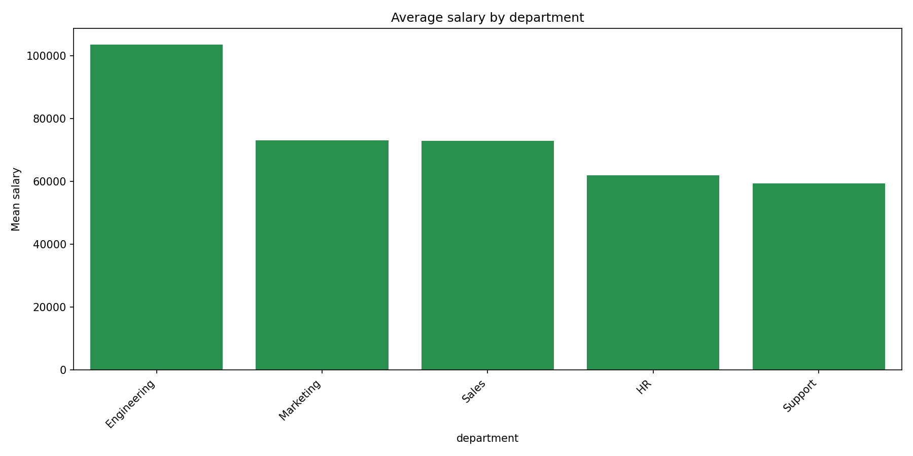
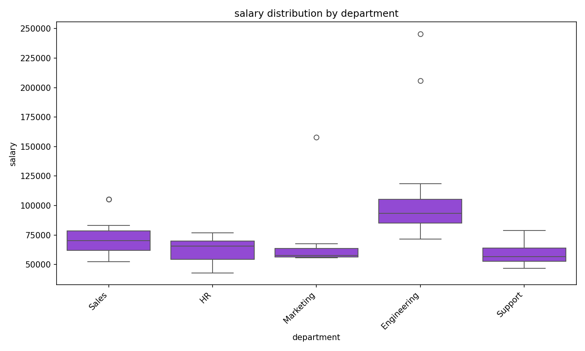
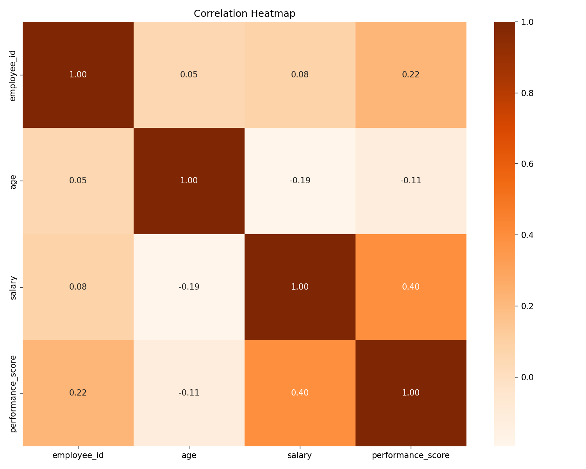
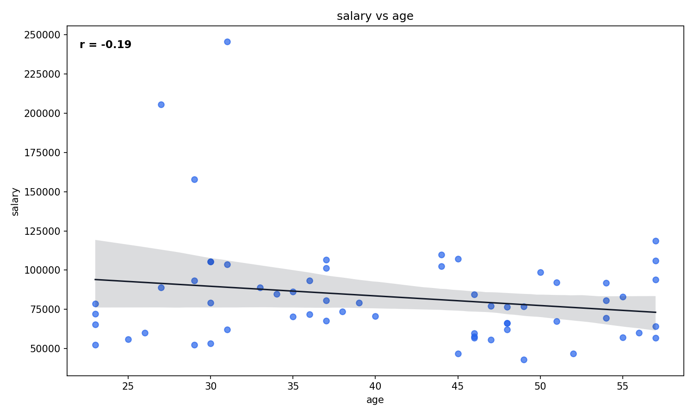
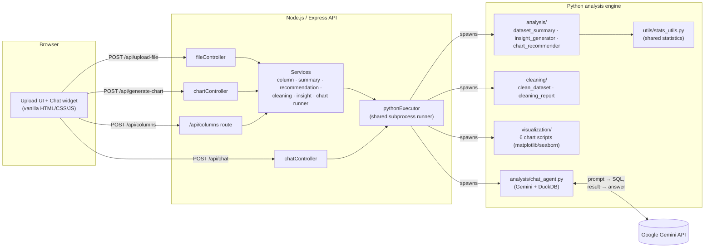

# Insight2C
**Exploratory data analysis in the browser.** Upload a CSV, Excel (`.xlsx`), or JSON file and get back a data-quality score, skew-aware summary statistics, IQR-based outlier detection, ranked correlations, plain-English insights, data-grounded chart recommendations, six chart types, and an AI assistant that answers questions about your data in natural language.

Insight2C is a full-stack application: a Node.js/Express API handles uploads and routing, a Python engine (pandas, NumPy, matplotlib, seaborn, DuckDB) performs the analysis, and a lightweight vanilla-JavaScript frontend ties it together. The conversational assistant is powered by Google Gemini.

---

## Table of Contents

- [Sample Output](#sample-output)
- [Features](#features)
- [How It Works](#how-it-works)
- [Architecture](#architecture)
- [Tech Stack](#tech-stack)
- [Project Structure](#project-structure)
- [Getting Started](#getting-started)
- [Configuration](#configuration)
- [API Reference](#api-reference)
- [Running Tests](#running-tests)
- [Notes and Limitations](#notes-and-limitations)
- [License](#license)

---

## Sample Output

Charts generated from the included [`sample_data/employee_dataset.csv`](sample_data/employee_dataset.csv):

| Bar chart | Box plot |
|---|---|
|  |  |
| **Correlation heatmap** | **Scatter plot** |
|  |  |

---

## Features

### Data quality scoring
A single 0–100 score that answers "is this dataset usable?" before any charts are built. Missing cells cost up to 60 points and duplicate rows up to 40 points, since missing values usually block more analyses than a few duplicates do. A separate cleaning report flags fully empty columns and columns that look numeric but are stored as text (for example `"1,200"` or `"$45"`).

### Statistical summary
FFor every numeric column: mean, median, standard deviation, min/max, quartiles, IQR, and skewness. For categorical columns: number of unique values and the most common value with its share, with near-unique columns (more than 95% unique values, such as names or IDs) flagged as likely identifiers.
### IQR-based outlier detection
Values outside `Q1 − 1.5 × IQR` and `Q3 + 1.5 × IQR` are counted as outliers for each numeric column. This is more robust than min/max values on skewed data.

### Correlation analysis
Numeric column pairs are ranked by absolute Pearson correlation and labelled by strength (strong ≥ 0.7, moderate ≥ 0.4, weak ≥ 0.2).

### Plain-English insights
A short narrative of the most important findings (quality score, missingness, duplicates, skew, outliers, and notable correlations) in place of a raw statistics dump.

### Data-grounded chart recommendations
Each suggestion comes with a reason based on the actual data:
- **Heatmap:** three or more numeric columns. The strongest correlation is named when one is moderate or strong.
- **Scatter:** two or more numeric columns. The most correlated pair is named.
- **Box plot:** only when outliers were actually detected.
- **Bar / Pie:** only for categorical columns that are not identifier-like, which avoids charts such as a 500-slice pie.
- **Histogram:** any numeric column.

### On-the-fly cleaning
Before a chart is generated, you can remove duplicate rows, drop rows with missing values, or fill missing values with the column mean, median, or mode. The cleaned dataset can be downloaded as a CSV.

### AI data assistant
A chat widget lets you ask questions such as *"What is the average salary by department?"*. Gemini (`gemini-2.5-flash`) translates the question into SQL, DuckDB runs it in-process against your dataset, and Gemini turns the result into a conversational answer.

---

## How It Works

1. **Upload.** Drag and drop (or browse for) a `.csv`, `.xlsx`, or `.json` file of up to 50 MB. The app extracts column types and returns the dataset summary, quality score, and chart recommendations.
2. **Configure.** Choose one of six chart types (histogram, bar, pie, scatter, heatmap, box plot). The X/Y column dropdowns are filtered by column type, and histograms have an adjustable bin count. Pick a chart color.
3. **Clean.** Optionally remove duplicates, drop rows with missing values, or choose a fill strategy (mean, median, or mode).
4. **Visualize and export.** The server cleans the data, renders the chart, and returns it with a refreshed summary, a cleaning report, plain-English insights, and a download link for the cleaned CSV.
5. **Chat with your data.** Open the chat bubble in the bottom-right corner and ask analytical questions in natural language.

---

## Architecture

Node.js owns HTTP, file handling, and orchestration. Each analysis step runs as a short-lived Python subprocess through a single shared runner (`pythonExecutor.js`), which returns JSON, a file path, or plain text.



`dataset_summary.py`, `insight_generator.py`, and `chart_recommender.py` all compute their statistics through `utils/stats_utils.py`, so the numbers in the Summary panel, the Insights panel, and the chart recommendations always agree. File loading and the chart color palette are centralized in `utils/io_utils.py`.

---

## Tech Stack

| Layer | Tools |
|---|---|
| **Backend API** | Node.js, Express 5, Multer (uploads), CORS, dotenv |
| **Analysis engine** | Python, pandas, NumPy, DuckDB (in-process SQL) |
| **AI integration** | Google Gen AI SDK (`google-genai`), model `gemini-2.5-flash` |
| **Visualization** | matplotlib, seaborn |
| **Frontend** | Vanilla HTML, CSS, and JavaScript (no framework) |
| **Testing** | pytest |

---

## Project Structure

```
Insignt-2C/
├── backend/
│   ├── server.js              # Entry point (port 5000)
│   ├── app.js                 # Express app: middleware, static files, routes, error handling
│   ├── routes/                # /api/upload-file, /api/generate-chart, /api/columns, /api/chat
│   ├── controllers/           # Request handlers for upload, chart, and chat
│   ├── services/              # Thin wrappers that invoke Python scripts
│   ├── middleware/            # Multer upload config (type + 50 MB size limit)
│   ├── uploads/               # Raw uploaded files (git-ignored)
│   ├── cleaned_data/          # Cleaned CSV output (git-ignored)
│   └── generated_charts/      # Rendered chart images (git-ignored)
├── frontend/
│   ├── pages/upload.html      # Single-page UI
│   ├── js/                    # upload.js (main UI), chat.js (assistant widget)
│   └── css/
├── python/
│   ├── analysis/              # Summary, insights, chart recommendations, chat agent
│   ├── cleaning/              # Dataset cleaning and data-quality report
│   ├── visualization/         # One script per chart type
│   ├── utils/                 # Shared stats, I/O, and column helpers
│   ├── tests/                 # pytest suite for stats_utils
│   ├── requirements.txt
│   └── requirements-dev.txt
├── sample_data/               # Example dataset
└── docs/sample-output/        # Example chart images
```

---

## Getting Started

### Prerequisites

- **Node.js** 18 or later
- **Python** 3.9 or later
- A **Google Gemini API key** (needed only for the chat assistant). You can create one in [Google AI Studio](https://aistudio.google.com/apikey).

### 1. Clone the repository

```bash
git clone https://github.com/Ayush0604-alt/Insignt-2C.git
cd Insignt-2C
```

### 2. Configure environment variables

Create a file named `.env` in the **project root** (not inside `backend/`):

```dotenv
GEMINI_API_KEY=your_api_key_here
```

> On Windows, create this file in your editor rather than with `echo ... > .env` in PowerShell. PowerShell writes UTF-16 by default, which `dotenv` cannot read.

### 3. Install backend dependencies

```bash
cd backend
npm install
```

### 4. Set up the Python environment

```bash
cd ../python
python -m venv venv

# macOS / Linux
source venv/bin/activate
# Windows (PowerShell)
venv\Scripts\Activate.ps1

pip install -r requirements.txt
```

### 5. Start the server

From the **same terminal** (so the virtual environment's Python is on your `PATH`):

```bash
cd ../backend
npm start          # or: npm run dev  (auto-restarts with nodemon)
```

Open **http://localhost:5000** in your browser. To try it straight away, upload [`sample_data/employee_dataset.csv`](sample_data/employee_dataset.csv).

---

## Configuration

| Variable | Required | Default | Description |
|---|---|---|---|
| `GEMINI_API_KEY` | For chat only | none | Google Gemini API key used by the AI data assistant. All other features work without it. |
| `PYTHON_BIN` | No | `python` on Windows, `python3` elsewhere | Python interpreter the backend spawns. Set this to your virtual environment's interpreter (e.g. `python/venv/bin/python`) if you start the server from a shell where the venv isn't active. |

The server listens on port **5000** (set in `backend/server.js`).

---

## API Reference

All endpoints accept and return JSON, except `/api/upload-file`, which accepts `multipart/form-data`. Errors are returned as `{ "message": "..." }` with a 4xx or 5xx status code.

### `POST /api/upload-file`

Uploads a dataset and runs the initial analysis.

| Field | Type | Description |
|---|---|---|
| `file` | file | `.csv`, `.xlsx`, or `.json`, max 50 MB (larger files return `413`) |

**Response:**
```json
{
  "message": "File uploaded successfully",
  "filePath": "<server path of the uploaded file>",
  "columns": { "all_columns": [], "numeric_columns": [], "categorical_columns": [] },
  "summary": { "rows": 0, "columns": 0, "data_quality_score": 0, "...": "..." },
  "recommendations": [{ "chart": "scatter", "reason": "..." }]
}
```

### `POST /api/generate-chart`

Cleans the dataset with the selected options, renders a chart, and re-runs the analysis on the cleaned data.

| Field | Type | Description |
|---|---|---|
| `filePath` | string | **Required.** The `filePath` returned by `/api/upload-file` |
| `chartType` | string | **Required.** `histogram`, `bar`, `pie`, `scatter`, `heatmap`, or `boxplot` |
| `xColumn` | string | X-axis column (or the value column for histogram, pie, and box plot) |
| `yColumn` | string | Y-axis column for bar and scatter; optional group-by column for box plot |
| `chartColor` | string | `orange` (default), `blue`, `green`, `red`, `purple`, `black`, `pink`, `yellow`, `brown`, or `gray` |
| `bins` | number | Histogram bin count (default `20`) |
| `removeDuplicates` | boolean | Drop duplicate rows |
| `dropMissing` | boolean | Drop rows containing missing values |
| `missingStrategy` | string | Fill missing values: `mean`, `median`, `mode`, or `""` (none) |

**Response:**
```json
{
  "message": "Chart generated successfully",
  "imageUrl": "http://localhost:5000/generated_charts/<file>.png",
  "cleanedFileUrl": "http://localhost:5000/cleaned_data/cleaned_<timestamp>.csv",
  "summary": { "...": "..." },
  "cleaningReport": { "...": "..." },
  "insights": ["Overall data quality score: 94/100 (...)", "..."]
}
```

### `POST /api/columns`

| Field | Type | Description |
|---|---|---|
| `filePath` | string | Path returned by `/api/upload-file` |

**Response:** `{ "all_columns": [], "numeric_columns": [], "categorical_columns": [] }`

### `POST /api/chat`

| Field | Type | Description |
|---|---|---|
| `filePath` | string | **Required.** Path returned by `/api/upload-file` |
| `query` | string | **Required.** A natural-language question about the dataset |

**Response:** `{ "reply": "<natural-language answer>" }`

---

## Running Tests

The statistical core (`python/utils/stats_utils.py`) is covered by a pytest suite. From the repository root, with the virtual environment active:

```bash
pip install -r python/requirements-dev.txt
pytest python/tests -v
```

---

## Notes and Limitations

- **Data privacy.** All statistics, cleaning, and charting run locally. The chat assistant sends the dataset's column names and types, your question, and the SQL query result to the Google Gemini API. It does not send the full dataset.
- **Local use.** The API has no authentication and accepts server-side file paths from the client. Run it locally or on a trusted network, not as a public service.
- **Storage.** Uploaded files, cleaned datasets, and generated charts accumulate in `backend/uploads/`, `backend/cleaned_data/`, and `backend/generated_charts/` and are not cleaned up automatically.
