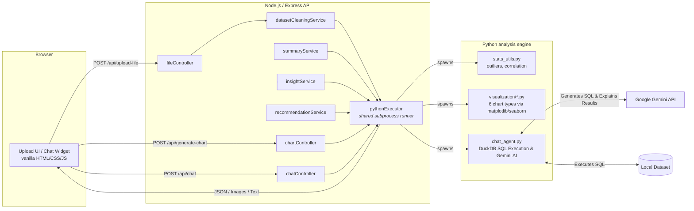

# Insight2C

**Upload a CSV/Excel/JSON file. Get a real exploratory data analysis back: data quality scoring, outlier detection, correlation strength, skew-aware summary statistics, plain-English insights, six chart types, and an AI-powered conversational data assistant — all in your browser.**

Insight2C is a full-stack Exploratory Data Analysis (EDA) platform. A Node/Express API orchestrates a powerful Python backend (pandas, NumPy, DuckDB, Gemini AI, matplotlib, seaborn). The lightweight vanilla-JS frontend lets you upload a dataset, clean it, interactively explore it, and even chat with it using natural language.

---

## 🛠️ Features: What We Use and Why

Insight2C focuses on giving you actionable analytics instead of just a raw data dump. 

- **Data Quality Scoring**
  - **What:** A single 0–100 score combining missingness and duplicate-row penalties.
  - **Why:** Analysts need an immediate, concrete answer to "Is this dataset usable?" before they waste time building charts on broken data.
- **Narrative Insights & AI Data Assistant (Chatbot)**
  - **What:** An integrated conversational widget powered by **Google Gemini** and **DuckDB**. 
  - **Why:** Instead of guessing how to write complex SQL, you can ask questions like *"What is the average salary by department?"* Gemini translates your natural language into SQL, DuckDB executes it locally against the dataset for blazing-fast in-memory analytics, and Gemini replies with a human-readable answer.
- **IQR-based Outlier Detection**
  - **What:** Automatically identifies statistical outliers on every numeric column using the Interquartile Range (IQR).
  - **Why:** Simple min/max values are often deceiving. IQR provides a mathematically robust way to flag skewed data.
- **Grounded Chart Recommendations**
  - **What:** Suggests charts contextually. E.g., it won't suggest a Heatmap unless there are at least two strongly correlated numeric columns, and it hides identifier columns (`user_id`) from pie charts.
  - **Why:** Prevents users from generating useless visualizations (like a 60-slice pie chart) and guides them toward statistically significant relationships.

---

## 🔄 User Workflow

1. **Upload:** Drag-and-drop a CSV, JSON, or Excel file into the app. The system immediately analyzes the columns, generates data quality scores, and provides natural-language insights.
2. **Configure:** Select a chart type (Histogram, Bar, Pie, Scatter, Heatmap, Boxplot). The app dynamically filters the X/Y axis dropdowns based on the column types (categorical vs. numeric).
3. **Clean:** Toggle switches to drop missing rows or remove duplicates on-the-fly before generating the chart.
4. **Visualize & Export:** The app generates the requested chart and returns a high-resolution image, along with a link to download the freshly cleaned dataset.
5. **Chat with Data:** Click the orange chat bubble in the bottom right corner to open the AI Data Assistant. Ask any analytical question, and it will run SQL under the hood to give you an accurate answer.

---

## 🏗️ Architecture

Insight2C uses a multi-language micro-architecture where Node.js handles routing and client state, while Python handles the heavy mathematical lifting and AI integration.



Every JSON-returning Python script (`dataset_summary.py`, `insight_generator.py`, `chart_recommender.py`) shares the same statistics module (`stats_utils.py`), ensuring that the numbers in the Summary panel, the Insights panel, and the Chatbot are strictly consistent.

---

## 💻 Tech Stack

| Layer | Tools |
|---|---|
| **Backend API** | Node.js, Express 5, Multer (file uploads) |
| **Analysis Engine** | Python, pandas, NumPy, DuckDB (in-memory SQL) |
| **AI Integration** | Google GenAI SDK (`gemini-2.5-flash`) |
| **Visualization** | matplotlib, seaborn |
| **Frontend** | Vanilla HTML / CSS / JavaScript (No framework) |

---

## 🚀 Getting Started

**Prerequisites:** Node.js >= 18, Python >= 3.9

```bash
# 1. Clone the repository
git clone https://github.com/Ayush0604-alt/Insignt2C.git
cd Insignt2C

# 2. Setup Environment Variables
# Create a .env file in the root directory and add your Gemini API Key
echo "GEMINI_API_KEY=your_api_key_here" > .env

# 3. Install Backend Dependencies
cd backend
npm install

# 4. Setup Python Analysis Engine
cd ../python
python3 -m venv venv
source venv/bin/activate        # On Windows: venv\Scripts\activate
pip install -r requirements.txt

# 5. Run the Application
cd ../backend
npm start                       # or: npm run dev (auto-restart with nodemon)
```

Then open **http://localhost:5000** in your browser. You can upload the included [`sample_data/employee_dataset.csv`](sample_data/employee_dataset.csv) to try it immediately!

---

## 📡 API Reference

| Endpoint | Method | Body | Returns |
|---|---|---|---|
| `/api/upload-file` | POST | `multipart/form-data` with `file` | Cleaned file path, columns, summary, insights, chart recommendations |
| `/api/columns` | POST | `{ filePath }` | `{ all_columns, numeric_columns, categorical_columns }` |
| `/api/generate-chart` | POST | `{ filePath, chartType, xColumn, yColumn, chartColor, removeDuplicates, dropMissing, missingStrategy }` | `{ imageUrl }` |
| `/api/chat` | POST | `{ filePath, query }` | `{ reply }` (Natural language response from the AI assistant) |

`chartType` is one of: `histogram`, `bar`, `pie`, `scatter`, `heatmap`, `boxplot`.

---

## 📝 License

ISC
